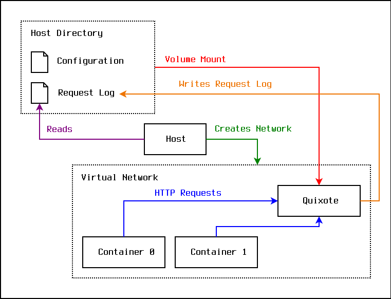

quixote
===

[](http://search.maven.org/#search%7Cga%7C1%7Cg%3A%22com.io7m.quixote%22)
[](https://s01.oss.sonatype.org/content/repositories/snapshots/com/io7m/quixote/)
[](https://codecov.io/gh/io7m/quixote)


| JVM | Platform | Status |
|-----|----------|--------|
| OpenJDK (Temurin) Current | Linux | [](https://github.com/io7m/quixote/actions?query=workflow%3Amain.linux.temurin.current)|
| OpenJDK (Temurin) LTS | Linux | [](https://github.com/io7m/quixote/actions?query=workflow%3Amain.linux.temurin.lts)|
| OpenJDK (Temurin) Current | Windows | [](https://github.com/io7m/quixote/actions?query=workflow%3Amain.windows.temurin.current)|
| OpenJDK (Temurin) LTS | Windows | [](https://github.com/io7m/quixote/actions?query=workflow%3Amain.windows.temurin.lts)|

## quixote

A tiny embedded HTTP server for unit testing.

### Features

  * An embedded HTTP server for simulating external services.
  * Conveniently enqueue responses to arbitrary requests.
  * Verify that requests were received as expected.
  * Zero dependencies for the core module (optional modules may have dependencies).
  * Written in pure Java 21.
  * [OSGi](https://www.osgi.org/) ready.
  * [JPMS](https://en.wikipedia.org/wiki/Java_Platform_Module_System) ready.
  * ISC license.
  * High-coverage automated test suite.

### Motivation

Any code that makes requests to an external service should be tested to
ensure that both the requests it makes are correct, and that it behaves
correctly when presented with various responses. The `quixote` package
provides a tiny embedded web server that can be configured to return canned
responses to specified requests.

### Building

```
$ mvn clean verify
```

### Usage

Create a `QWebServer` before each test. The server will listen on the
specified port.

```
@BeforeEach
public void setup()
  throws IOException
{
  this.server =
    QWebServers.createServer(42000);
  this.http =
    HttpClient.newHttpClient();
}
```

Enqueue responses to requests:

```
this.server.addResponse()
  .forMethod("GET")
  .forPath("/xyz")
  .withContentType("text/plain")
  .withFixedText("Hello 0.")
  .withStatus(201)
  .withHeader("Header-0", "XYZ");
```

Have code make requests to the server during tests, and then verify that
the server received the requests:

```
final var requests =
  new LinkedList<>(this.server.requestsReceived());

{
  final var req = requests.remove(0);
  assertEquals("GET", req.method());
  assertEquals("/xyz", req.path());
}
```

Remember to clean up the server after each test:

```
@AfterEach
public void tearDown()
  throws IOException
{
  this.server.close();
}
```

### OCI

The `quixote` server is also capable of acting as a standalone web server
for use in integration tests involving containers. This is primarily useful
for situations where an integration test starts multiple containers inside
an isolated virtual network, and one or more of the test containers need to
speak to a fake web server, and the host running the test suite needs to
observe the requests in question. This particular configuration can be
difficult to set up in an automated manner, as most virtual networking
solutions don't allow for containers to "talk back" to the host machine. Using
`quixote` as a container allows for it to be present inside the virtual network,
and for the host to download and parse request logs after the test has
completed, sidestepping the need for any containers to know about the host
machine.

In other words:

1. The host creates a virtual network using its container engine of choice.
2. The host creates several containers inside the virtual network.
3. The host writes a `quixote` configuration file in the host directory.
4. The host creates a `quixote` container inside the virtual network, mounting
   the host directory into the container as a volume mount.
5. The host runs the test. This causes the containers inside the virtual
   network to make requests to the `quixote` container.
6. The host reads the resulting request log from the host directory and
   verifies that the correct requests were made for the test.



Given a configuration file conforming to the provided
[schema](com.io7m.quixote.xml/src/main/resources/com/io7m/quixote/xml/configuration-1.xsd),
the `quixote` server can be started using a container engine such as
[Podman](https://podman.io).

```
$ cat quixote/config.xml

<?xml version="1.0" encoding="UTF-8" ?>

<Configuration xmlns="urn:com.io7m.quixote:configuration:1"
               Port="20001"
               GZIP="true">
  <Responses>
    <Response Method="GET"
              Path="/"
              Status="200">
      <Headers>
        <Header Name="Content-Type"
                Value="application/octet-stream"/>
      </Headers>
      <ContentUTF8>Hello world!</ContentUTF8>
    </Response>
  </Responses>
</Configuration>
```

```
$ podman run \
  --rm \
  --interactive \
  --tty \
  --volume quixote:/quixote/data:rw \
  --publish 20001:20001/tcp \
  quay.io/io7mcom/quixote:1.2.0-SNAPSHOT \
  /quixote/data/config.xml \
  /quixote/data/output.bin
INFO com.io7m.quixote.main.Main: Quixote running at http://localhost:20001/
```

```
$ curl http://localhost:20001/
Hello world!
```

The server appends every received request to a file consisting of an
array of request records in a trivial binary format. A request record has the
following structure:

```
RequestRecord
{
  Unsigned64  quixote;
  Unsigned32  version;
  Unsigned64  length;
  Unsigned8   data[length];
}
```

All integer values are in big-endian byte order.

The `quixote` field of the `RequestRecord` structure always has the value
`0x515549584F544521` ("QUIXOTE!" in ASCII). The `version` field of the
`RequestRecord` field currently has the value `0x00000001`.

The `data` field is a sequence of `length` bytes that represents a serialized
[java.util.Properties](https://docs.oracle.com/en/java/javase/21/docs/api/java.base/java/util/Properties.html)
XML document. For example, the `curl` request above resulted in the following
record being appended to `/quixote/output.bin`:

```
0000:0000 | 51 55 49 58  4F 54 45 21  00 00 00 01  00 00 00 00 | QUIXOTE!........
0000:0010 | 00 00 01 BF  3C 3F 78 6D  6C 20 76 65  72 73 69 6F | ...¿<?xml versio
0000:0020 | 6E 3D 22 31  2E 30 22 20  65 6E 63 6F  64 69 6E 67 | n="1.0" encoding
0000:0030 | 3D 22 55 54  46 2D 38 22  3F 3E 0A 3C  21 44 4F 43 | ="UTF-8"?>.<!DOC
0000:0040 | 54 59 50 45  20 70 72 6F  70 65 72 74  69 65 73 20 | TYPE properties
0000:0050 | 53 59 53 54  45 4D 20 22  68 74 74 70  3A 2F 2F 6A | SYSTEM "http://j
0000:0060 | 61 76 61 2E  73 75 6E 2E  63 6F 6D 2F  64 74 64 2F | ava.sun.com/dtd/
0000:0070 | 70 72 6F 70  65 72 74 69  65 73 2E 64  74 64 22 3E | properties.dtd">
0000:0080 | 0A 3C 70 72  6F 70 65 72  74 69 65 73  3E 0A 3C 65 | .<properties>.<e
0000:0090 | 6E 74 72 79  20 6B 65 79  3D 22 48 65  61 64 65 72 | ntry key="Header
0000:00A0 | 2E 72 65 6D  6F 74 65 2D  61 64 64 72  22 3E 31 32 | .remote-addr">12
0000:00B0 | 37 2E 30 2E  30 2E 31 3C  2F 65 6E 74  72 79 3E 0A | 7.0.0.1</entry>.
0000:00C0 | 3C 65 6E 74  72 79 20 6B  65 79 3D 22  49 6E 66 6F | <entry key="Info
0000:00D0 | 2E 4D 65 74  68 6F 64 22  3E 47 45 54  3C 2F 65 6E | .Method">GET</en
0000:00E0 | 74 72 79 3E  0A 3C 65 6E  74 72 79 20  6B 65 79 3D | try>.<entry key=
0000:00F0 | 22 48 65 61  64 65 72 2E  68 74 74 70  2D 63 6C 69 | "Header.http-cli
0000:0100 | 65 6E 74 2D  69 70 22 3E  31 32 37 2E  30 2E 30 2E | ent-ip">127.0.0.
0000:0110 | 31 3C 2F 65  6E 74 72 79  3E 0A 3C 65  6E 74 72 79 | 1</entry>.<entry
0000:0120 | 20 6B 65 79  3D 22 49 6E  66 6F 2E 50  61 74 68 22 |  key="Info.Path"
0000:0130 | 3E 2F 3C 2F  65 6E 74 72  79 3E 0A 3C  65 6E 74 72 | >/</entry>.<entr
0000:0140 | 79 20 6B 65  79 3D 22 48  65 61 64 65  72 2E 61 63 | y key="Header.ac
0000:0150 | 63 65 70 74  22 3E 2A 2F  2A 3C 2F 65  6E 74 72 79 | cept">*/*</entry
0000:0160 | 3E 0A 3C 65  6E 74 72 79  20 6B 65 79  3D 22 48 65 | >.<entry key="He
0000:0170 | 61 64 65 72  2E 75 73 65  72 2D 61 67  65 6E 74 22 | ader.user-agent"
0000:0180 | 3E 63 75 72  6C 2F 38 2E  37 2E 31 3C  2F 65 6E 74 | >curl/8.7.1</ent
0000:0190 | 72 79 3E 0A  3C 65 6E 74  72 79 20 6B  65 79 3D 22 | ry>.<entry key="
0000:01A0 | 48 65 61 64  65 72 2E 68  6F 73 74 22  3E 31 32 37 | Header.host">127
0000:01B0 | 2E 30 2E 30  2E 31 3A 32  30 30 30 31  3C 2F 65 6E | .0.0.1:20001</en
0000:01C0 | 74 72 79 3E  0A 3C 2F 70  72 6F 70 65  72 74 69 65 | try>.</propertie
0000:01D0 | 73 3E 0A                                           | s>.
```

Extracting the XML document and formatting it gives:

```
<?xml version="1.0" encoding="UTF-8"?>
<!DOCTYPE properties SYSTEM "http://java.sun.com/dtd/properties.dtd">
<properties>
<entry key="Header.remote-addr">127.0.0.1</entry>
<entry key="Info.Method">GET</entry>
<entry key="Header.http-client-ip">127.0.0.1</entry>
<entry key="Info.Path">/</entry>
<entry key="Header.accept">*/*</entry>
<entry key="Header.user-agent">curl/8.7.1</entry>
<entry key="Header.host">127.0.0.1:20001</entry>
</properties>
```

We can see that the client made a `GET` request to the `/` path. The
[QWebRequestLogging](com.io7m.quixote.core/src/main/java/com/io7m/quixote/core/QWebRequestLogging.java)
class provides convenient functions to read and write request logs.

